RDD Code
================
Duarte Amaro
2026-09-08

Ahead of the 1951 legislative elctions, the *loi des apparentements*
modified the existing electoral system in France by introducing the
possibility of alliances between two separate lists. Elections used
open-list PR, with electoral districts corresponding in most cases to
the department (with the exception of a few highly populous departments
like Seine, Rhône, or Nord). Two or more lists could, if they were
backed by a nationally recognised party competing in at least 30 other
districts, form an *apparentement*. The seat distribution would proceed
as follows: if any list secured an outright 50% majority, it would fill
all seats (this condition was never met); otherwise, if the sum of the
votes for a group of *apparentées* lists was greater than a 50%
majority, all seats were attributed to this alliance, and divided
amongst them proportionally (through the highest averages method);
otherwise, seats were attributed proportionally, counting each
*apparentée* list together.

In the context in which the law was passed, it was clearly aimed at
reducing the parliamentary influence of the Communist Party (PCF) and
the Gaullist RPF - two parties that mobilised clear opposition to the
French Fourth Republic - and increasing that of the so-called *Troisième
Force*, the centrist coalition stretching from the Socialists to the
moderate Right, including the Radicals and the Christian Democrats of
the MRP. Because the two parties opposing the system were at its
extremes and could not ally with each other, any *apparentement* was,
for them, quite unlikely. This was especially the case for the PCF. The
RPF did, however, manage to form a few alliances with other right-wing
parties, and, in one occasion, even with the radicals.

The law did not apply to two departments (Seine and Seine-et-Oise),
corresponding to Paris and its suburbs. Out of the 95 electoral
districts to which it applied, only in 12 was no *apparentement* formed.
In 39 electoral districts, an *apparentement* secured over 50% of the
vote and therefore gained all of the district’s seats. Consider the
example of the department of Vienne. The PCF arrived first with 24% of
the vote, followed by the RPF with 21%. The MRP scored 13%, the Radicals
12%, and the final quarter of the vote went to four other centrist
parties. However, the department’s four seats went to centrist group
which, having formed an *apparentement*, scored just over 53% of the
vote, leaving the two first-placed parties without parliamentary
representation.

This bonus likely contributed to a greater majority than the *Troisième
Force* would otherwise have secured, but what were its political
implications later on? Especially given the rise of the Poujadist
movement in the following years, it is plausible that this electoral
reform may have actually increased support for later anti-system
parties. This is what this paper aims to explore, leveraging the 50%
threshold in a regression discontinuity (RD) design.

We obtain electoral data on the 1951 and 1956 elections from the
official publications by the French Ministry of the Interior as well as
from the sessions of the National Assembly in which the results were
officially validated. We also obtain a few other socioeconomic variables
from several statistical publications from the time (the “Tableaux de
l’économie française” and the “Annuaire statistique de la France”,
published by the *Institut national de la statistique et des études
économiques*, and available as a PDF in the French National Library’s
website).

    ## # A tibble: 3 × 3
    ##   type               count share
    ##   <chr>              <int> <dbl>
    ## 1 Apparentement Lost    44 0.463
    ## 2 Apparentement Won     39 0.411
    ## 3 No Apparentement      12 0.126

    ## # A tibble: 10 × 1
    ##    old_department    
    ##    <chr>             
    ##  1 CORSE             
    ##  2 BOUCHES_DU_RHONE_1
    ##  3 BOUCHES_DU_RHONE_2
    ##  4 NORD_2            
    ##  5 NORD_3            
    ##  6 PAS_DE_CALAIS_2   
    ##  7 RHONE_1           
    ##  8 RHONE_2           
    ##  9 SEINE_INFERIEURE_1
    ## 10 SEINE_INFERIEURE_2

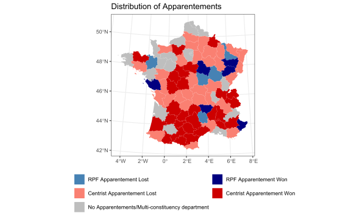

# DV is Poujadist Vote

We are first limiting the sample to the set of departments where a
centrist *apparentement* was agreed, and examining as the DV the support
for the UFF - Poujade’s party itself.

## Visual representation

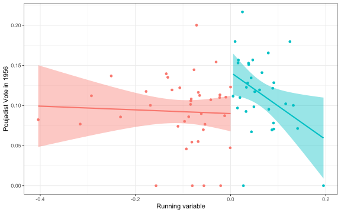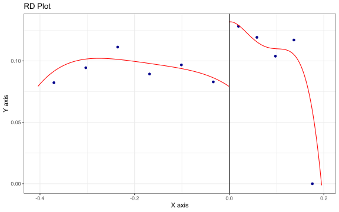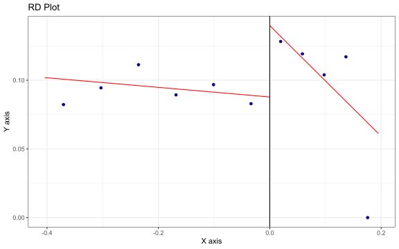

## RD Robust Estimation

We use the `rdrobust` package developed by Cattaneo and co-authors to
estimate the regression discontinuity models, as it implements
data-driven bandwidth selection and bias-corrected inference.

The mean-squared-error optimal bandwidth selection procedure determines
how much of the data around the cutoff should be used by balancing the
greater precision obtained from a wider bandwidth against the increased
risk of bias from observations farther from the cutoff. Bandwidths are
selected separately on either side of the cutoff to account for
differences in the distribution and relationship between the running and
outcome variables. Inference is based on robust bias-corrected standard
errors and confidence intervals, which account for the additional
uncertainty associated with estimating and correcting the bias of the
local polynomial estimator.

The effect is significant at the 5% when using employing a triangular
and Epanechnikov kernel, and the substantive magnitude is of 7.6 to 7.8
percentage points - a substantial increase in support for the
Poujadists. This means that in district where a centrist *apparentement*
narrowly won a majority (and therefore secured all seats) in 1951, the
Poujadists scored about 7 percentage points higher in 1956, compared to
districts where a centrist *apparentement* narrowly failed to win a
majority.

    ## Call: rdrobust
    ## 
    ## Sharp RD estimates using local polynomial regression.
    ## 
    ## Number of Obs.                   71
    ## BW type                       mserd
    ## Kernel                   Triangular
    ## VCE method                       NN
    ## 
    ##                                Left        Right
    ## Number of Obs.                   38           33
    ## Eff. Number of Obs.               8           19
    ## Order est. (p)                    1            1
    ## Order bias (q)                    2            2
    ## BW est. (h)                   0.052        0.052
    ## BW bias (b)                   0.083        0.083
    ## rho (h/b)                     0.629        0.629
    ## Unique Obs.                      38           33
    ## 
    ## =====================================================================
    ##                    Point    Robust Inference
    ##                 Estimate         z     P>|z|      [ 95% C.I. ]       
    ## ---------------------------------------------------------------------
    ##      RD Effect     0.076     2.848     0.004     [0.025 , 0.137]     
    ## =====================================================================

    ## Call: rdrobust
    ## 
    ## Sharp RD estimates using local polynomial regression.
    ## 
    ## Number of Obs.                   71
    ## BW type                       mserd
    ## Kernel                   Epanechnikov
    ## VCE method                       NN
    ## 
    ##                                Left        Right
    ## Number of Obs.                   38           33
    ## Eff. Number of Obs.               8           16
    ## Order est. (p)                    1            1
    ## Order bias (q)                    2            2
    ## BW est. (h)                   0.044        0.044
    ## BW bias (b)                   0.075        0.075
    ## rho (h/b)                     0.590        0.590
    ## Unique Obs.                      38           33
    ## 
    ## =====================================================================
    ##                    Point    Robust Inference
    ##                 Estimate         z     P>|z|      [ 95% C.I. ]       
    ## ---------------------------------------------------------------------
    ##      RD Effect     0.078     2.599     0.009     [0.021 , 0.147]     
    ## =====================================================================

    ## Call: rdrobust
    ## 
    ## Sharp RD estimates using local polynomial regression.
    ## 
    ## Number of Obs.                   71
    ## BW type                       mserd
    ## Kernel                      Uniform
    ## VCE method                       NN
    ## 
    ##                                Left        Right
    ## Number of Obs.                   38           33
    ## Eff. Number of Obs.              13           21
    ## Order est. (p)                    1            1
    ## Order bias (q)                    2            2
    ## BW est. (h)                   0.066        0.066
    ## BW bias (b)                   0.097        0.097
    ## rho (h/b)                     0.682        0.682
    ## Unique Obs.                      38           33
    ## 
    ## =====================================================================
    ##                    Point    Robust Inference
    ##                 Estimate         z     P>|z|      [ 95% C.I. ]       
    ## ---------------------------------------------------------------------
    ##      RD Effect     0.046     1.570     0.116    [-0.013 , 0.115]     
    ## =====================================================================

## Visualising the results with correct BW

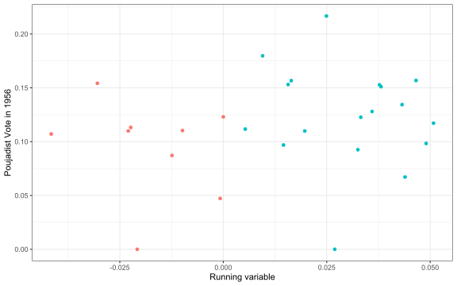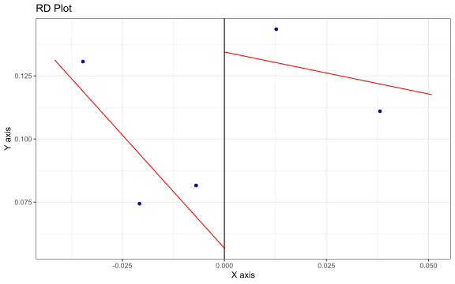

    ## NULL

## Including RPF Apparentement Departments

If we now include departments where an *apparentement* was established
not between the centrists but between some centrist parties (usually the
Independents and Peasants or the Christian Democrats of the MRP) and the
Gaullists, we might expect to find a weaker effect. Voters in these
departments might presumably still find the electoral law unjust but the
oligolopoly and anti-extremist element that one might hypothesise would
drive increased support for the Poujadists in the next electoral cycle
would be diminished. Indeed, this is what we find. The effects remain
significant but decrease in magnitude.

    ## Call: rdrobust
    ## 
    ## Sharp RD estimates using local polynomial regression.
    ## 
    ## Number of Obs.                   83
    ## BW type                       mserd
    ## Kernel                   Triangular
    ## VCE method                       NN
    ## 
    ##                                Left        Right
    ## Number of Obs.                   43           40
    ## Eff. Number of Obs.              14           23
    ## Order est. (p)                    1            1
    ## Order bias (q)                    2            2
    ## BW est. (h)                   0.058        0.058
    ## BW bias (b)                   0.088        0.088
    ## rho (h/b)                     0.661        0.661
    ## Unique Obs.                      43           40
    ## 
    ## =====================================================================
    ##                    Point    Robust Inference
    ##                 Estimate         z     P>|z|      [ 95% C.I. ]       
    ## ---------------------------------------------------------------------
    ##      RD Effect     0.062     2.277     0.023     [0.009 , 0.125]     
    ## =====================================================================

    ## Call: rdrobust
    ## 
    ## Sharp RD estimates using local polynomial regression.
    ## 
    ## Number of Obs.                   83
    ## BW type                       mserd
    ## Kernel                   Epanechnikov
    ## VCE method                       NN
    ## 
    ##                                Left        Right
    ## Number of Obs.                   43           40
    ## Eff. Number of Obs.              10           23
    ## Order est. (p)                    1            1
    ## Order bias (q)                    2            2
    ## BW est. (h)                   0.054        0.054
    ## BW bias (b)                   0.084        0.084
    ## rho (h/b)                     0.640        0.640
    ## Unique Obs.                      43           40
    ## 
    ## =====================================================================
    ##                    Point    Robust Inference
    ##                 Estimate         z     P>|z|      [ 95% C.I. ]       
    ## ---------------------------------------------------------------------
    ##      RD Effect     0.069     2.314     0.021     [0.011 , 0.134]     
    ## =====================================================================

    ## Call: rdrobust
    ## 
    ## Sharp RD estimates using local polynomial regression.
    ## 
    ## Number of Obs.                   83
    ## BW type                       mserd
    ## Kernel                      Uniform
    ## VCE method                       NN
    ## 
    ##                                Left        Right
    ## Number of Obs.                   43           40
    ## Eff. Number of Obs.               9           19
    ## Order est. (p)                    1            1
    ## Order bias (q)                    2            2
    ## BW est. (h)                   0.044        0.044
    ## BW bias (b)                   0.082        0.082
    ## rho (h/b)                     0.538        0.538
    ## Unique Obs.                      43           40
    ## 
    ## =====================================================================
    ##                    Point    Robust Inference
    ##                 Estimate         z     P>|z|      [ 95% C.I. ]       
    ## ---------------------------------------------------------------------
    ##      RD Effect     0.065     2.229     0.026     [0.009 , 0.134]     
    ## =====================================================================

# Diagnostics

## Density at the cutoff

We can test for potential manipulations of the running variable around
the cutoff using the `rddensity()` procedure, which tests for a
discontinuity in the density of the running variable at the cutoff using
local polynomial density estimation. The test provides no evidence of a
density discontinuity at the cutoff. The binomial tests also show no
significant imbalance in the number of observations on either side of
the cutoff across the examined windows.

    ## 
    ## Manipulation testing using local polynomial density estimation.
    ## 
    ## Number of obs =       71
    ## Model =               unrestricted
    ## Kernel =              triangular
    ## BW method =           estimated
    ## VCE method =          jackknife
    ## 
    ## c = 0                 Left of c           Right of c          
    ## Number of obs         38                  33                  
    ## Eff. Number of obs    23                  28                  
    ## Order est. (p)        2                   2                   
    ## Order bias (q)        3                   3                   
    ## BW est. (h)           0.088               0.112               
    ## 
    ## Method                T                   P > |T|             
    ## Robust                -0.092              0.9267              
    ## 
    ## 
    ## P-values of binomial tests (H0: p=0.5).
    ## 
    ## Window Length              <c     >=c    P>|T|
    ## 0.083     + 0.083          20      23    0.7608
    ## 0.083     + 0.086          20      23    0.7608
    ## 0.084     + 0.089          21      25    0.6587
    ## 0.084     + 0.092          22      28    0.4799
    ## 0.085     + 0.096          22      28    0.4799
    ## 0.086     + 0.099          22      28    0.4799
    ## 0.086     + 0.102          22      28    0.4799
    ## 0.087     + 0.105          22      28    0.4799
    ## 0.087     + 0.108          22      28    0.4799
    ## 0.088     + 0.112          23      28    0.5758

## Placebo cutoff

We see that no similar discontinuity can be found at a placebo cut-off
(say, 55% rather than 50%).

    ## Call: rdrobust
    ## 
    ## Sharp RD estimates using local polynomial regression.
    ## 
    ## Number of Obs.                   71
    ## BW type                       mserd
    ## Kernel                   Triangular
    ## VCE method                       NN
    ## 
    ##                                Left        Right
    ## Number of Obs.                   56           15
    ## Eff. Number of Obs.              13            5
    ## Order est. (p)                    1            1
    ## Order bias (q)                    2            2
    ## BW est. (h)                   0.034        0.034
    ## BW bias (b)                   0.051        0.051
    ## rho (h/b)                     0.660        0.660
    ## Unique Obs.                      56           15
    ## 
    ## =====================================================================
    ##                    Point    Robust Inference
    ##                 Estimate         z     P>|z|      [ 95% C.I. ]       
    ## ---------------------------------------------------------------------
    ##      RD Effect    -0.004    -0.305     0.760    [-0.086 , 0.063]     
    ## =====================================================================

    ## Call: rdrobust
    ## 
    ## Sharp RD estimates using local polynomial regression.
    ## 
    ## Number of Obs.                   71
    ## BW type                       mserd
    ## Kernel                   Epanechnikov
    ## VCE method                       NN
    ## 
    ##                                Left        Right
    ## Number of Obs.                   56           15
    ## Eff. Number of Obs.              11            3
    ## Order est. (p)                    1            1
    ## Order bias (q)                    2            2
    ## BW est. (h)                   0.029        0.029
    ## BW bias (b)                   0.045        0.045
    ## rho (h/b)                     0.643        0.643
    ## Unique Obs.                      56           15
    ## 
    ## =====================================================================
    ##                    Point    Robust Inference
    ##                 Estimate         z     P>|z|      [ 95% C.I. ]       
    ## ---------------------------------------------------------------------
    ##      RD Effect    -0.009    -0.326     0.744    [-0.092 , 0.066]     
    ## =====================================================================

    ## Call: rdrobust
    ## 
    ## Sharp RD estimates using local polynomial regression.
    ## 
    ## Number of Obs.                   71
    ## BW type                       mserd
    ## Kernel                      Uniform
    ## VCE method                       NN
    ## 
    ##                                Left        Right
    ## Number of Obs.                   56           15
    ## Eff. Number of Obs.              15            6
    ## Order est. (p)                    1            1
    ## Order bias (q)                    2            2
    ## BW est. (h)                   0.037        0.037
    ## BW bias (b)                   0.077        0.077
    ## rho (h/b)                     0.480        0.480
    ## Unique Obs.                      56           15
    ## 
    ## =====================================================================
    ##                    Point    Robust Inference
    ##                 Estimate         z     P>|z|      [ 95% C.I. ]       
    ## ---------------------------------------------------------------------
    ##      RD Effect     0.016     1.041     0.298    [-0.025 , 0.080]     
    ## =====================================================================

    ## Call: rdrobust
    ## 
    ## Covariate-adjusted Sharp RD estimates using local polynomial regression.
    ## 
    ## Number of Obs.                   61
    ## BW type                       mserd
    ## Kernel                   Triangular
    ## VCE method                       NN
    ## 
    ##                                Left        Right
    ## Number of Obs.                   46           15
    ## Eff. Number of Obs.               9            5
    ## Order est. (p)                    1            1
    ## Order bias (q)                    2            2
    ## BW est. (h)                   0.031        0.031
    ## BW bias (b)                   0.050        0.050
    ## rho (h/b)                     0.611        0.611
    ## Unique Obs.                      46           15
    ## 
    ## =====================================================================
    ##                    Point    Robust Inference
    ##                 Estimate         z     P>|z|      [ 95% C.I. ]       
    ## ---------------------------------------------------------------------
    ##      RD Effect     0.096     1.576     0.115    [-0.024 , 0.217]     
    ## =====================================================================

    ## Call: rdrobust
    ## 
    ## Covariate-adjusted Sharp RD estimates using local polynomial regression.
    ## 
    ## Number of Obs.                   61
    ## BW type                       mserd
    ## Kernel                   Epanechnikov
    ## VCE method                       NN
    ## 
    ##                                Left        Right
    ## Number of Obs.                   46           15
    ## Eff. Number of Obs.               8            3
    ## Order est. (p)                    1            1
    ## Order bias (q)                    2            2
    ## BW est. (h)                   0.028        0.028
    ## BW bias (b)                   0.050        0.050
    ## rho (h/b)                     0.560        0.560
    ## Unique Obs.                      46           15
    ## 
    ## =====================================================================
    ##                    Point    Robust Inference
    ##                 Estimate         z     P>|z|      [ 95% C.I. ]       
    ## ---------------------------------------------------------------------
    ##      RD Effect     0.208     1.675     0.094    [-0.036 , 0.463]     
    ## =====================================================================

    ## Call: rdrobust
    ## 
    ## Covariate-adjusted Sharp RD estimates using local polynomial regression.
    ## 
    ## Number of Obs.                   61
    ## BW type                       mserd
    ## Kernel                      Uniform
    ## VCE method                       NN
    ## 
    ##                                Left        Right
    ## Number of Obs.                   46           15
    ## Eff. Number of Obs.               8            3
    ## Order est. (p)                    1            1
    ## Order bias (q)                    2            2
    ## BW est. (h)                   0.027        0.027
    ## BW bias (b)                   0.061        0.061
    ## rho (h/b)                     0.444        0.444
    ## Unique Obs.                      46           15
    ## 
    ## =====================================================================
    ##                    Point    Robust Inference
    ##                 Estimate         z     P>|z|      [ 95% C.I. ]       
    ## ---------------------------------------------------------------------
    ##      RD Effect     0.212     1.824     0.068    [-0.019 , 0.539]     
    ## =====================================================================

## Power calculation

We see that we have few concerns regarding the power of our data for our
inferences, despite the low N.

    ## 
    ## Number of obs =       71
    ## BW type       =       mserd
    ## Kernel type   =       Triangular
    ## VCE method    =       NN
    ## Derivative    =       0
    ## HA:       tau =       0.1
    ## 
    ## 
    ## Cutoff c = 0          Left of c       Right of c      
    ## Number of obs         38              33              
    ## Eff. number of obs    8               19              
    ## BW loc. poly.         0.052           0.052           
    ## Order loc. poly.      1               1               
    ## Sampling BW           0.052           0.052           
    ## New sample            8               19              
    ## 
    ## 
    ## =========================================================================================
    ## Power against:           H0: tau =      0.2*tau =      0.5*tau =      0.8*tau =    tau =          
    ##                          0              0.02           0.05           0.08         0.1            
    ## -----------------------------------------------------------------------------------------
    ## Robust bias-corrected    0.05           0.108          0.419          0.802        0.939          
    ## =========================================================================================

## Local randomisation

Unlike traditional RD designs which we leverage earlier, local
randomisation assumes not that the dependent variable evolves linearly
(but for the discontinuity) as the running variable changes but instead
that, for a sufficiently small window around the cutoff, one can assume
that the treatment assignment is as good as random, and therefore use a
mere difference in means.

While this assumption is untestable, one can select the appropriate
window by examining how covariate balance changes at different values.

We use `rdwinselect()` from the R package `rdlocrand` to select the
local-randomisation window around the zero cutoff, testing balance
across six predetermined covariates (the share of non-French peope, the
share of farmers, the share of industrial workers, the unemployment
rate, the department’s budget revenue, and the share of people without
primary education) and applying a minimum balance $p$-value threshold of
0.10, with candidate windows increasing in increments of 0.005.

As expected under the local-randomisation framework, covariate balance
deteriorates as observations farther from the cutoff are included.

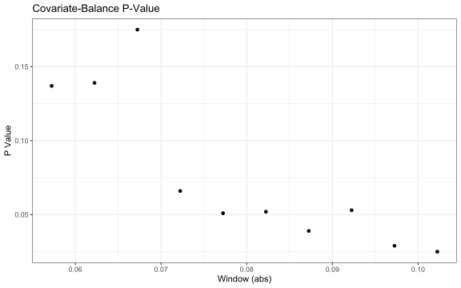

Whether we use the window for which the covariate balance p-value is the
highest, or the smallest window (for which the associated p-value is
still 0.137), we still obtain a positive and significant difference in
means.

    ## 
    ## Running rdwinselect...
    ## 
    ## rdwinselect complete.
    ## 
    ## Selected window = [-0.067;0.067] 
    ## 
    ## Running randomization-based test...
    ## Randomization-based test complete. 
    ## 
    ## 
    ## Number of obs     =            61
    ## Order of poly     =             0
    ## Kernel type       =       uniform
    ## Reps              =         10000
    ## Window            =   rdwinselect
    ## H0:          tau  =         0.000
    ## Randomization     = fixed margins
    ## 
    ## Cutoff c =    0.000   Left of c  Right of c
    ##       Number of obs          32          29
    ##  Eff. number of obs          11          17
    ##     Mean of outcome       0.078       0.126
    ##     S.d. of outcome       0.047       0.047
    ##              Window      -0.067       0.067
    ## 
    ## ================================================================================
    ##                                   Finite sample            Large sample         
    ##                                ------------------  -----------------------------
    ##           Statistic          T        P>|T|        P>|T|    Power vs d =   0.024
    ## ================================================================================
    ##      Diff. in means      0.049        0.012        0.008                   0.252
    ## ================================================================================

    ## 
    ## Selected window = [-0.057;0.057] 
    ## 
    ## Running randomization-based test...
    ## Randomization-based test complete. 
    ## 
    ## 
    ## Number of obs     =            61
    ## Order of poly     =             0
    ## Kernel type       =       uniform
    ## Reps              =         10000
    ## Window            =   set by user
    ## H0:          tau  =         0.000
    ## Randomization     = fixed margins
    ## 
    ## Cutoff c =    0.000   Left of c  Right of c
    ##       Number of obs          32          29
    ##  Eff. number of obs           9          15
    ##     Mean of outcome       0.072       0.126
    ##     S.d. of outcome       0.051       0.051
    ##              Window      -0.057       0.057
    ## 
    ## ================================================================================
    ##                                   Finite sample            Large sample         
    ##                                ------------------  -----------------------------
    ##           Statistic          T        P>|T|        P>|T|    Power vs d =   0.025
    ## ================================================================================
    ##      Diff. in means      0.053        0.020        0.012                   0.221
    ## ================================================================================

# DV is Poujadist + Apparantés Vote

We now consider the sum of support for the Poujadists and their allies.
As their allies did not field candidates everywhere and their lists were
named differently, we expect that the effect will be weaker.

## Visual representation

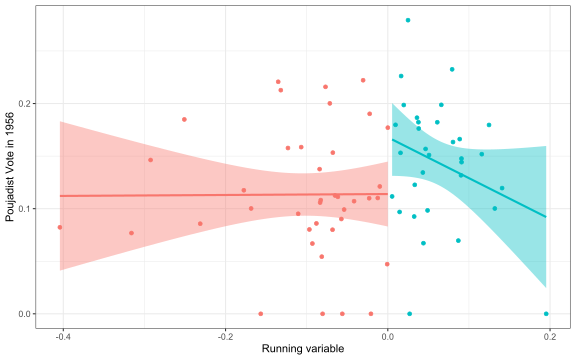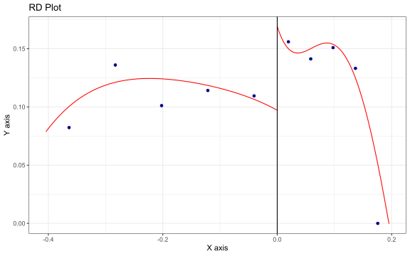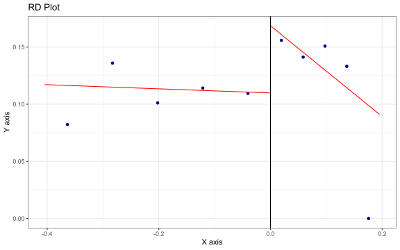

## RD Robust Estimation

The effect is less robust to different model specifications. We consider
first solely the departments without an RPF *apparentement* in 1951.
Using a triangular kernel, the effect is significant at the 5% level;
with an Epanechnikov kernel, it now has a p-value of 0.06. Using a
uniform kernel, and therefore weighting observations farther away from,
and closer to, the cutoff equally, the p-value is greater than 0.1.

Compared to the equivalent results using only the vote share for the UFF
(Pierre Poujade’s party), the magnitude of the point estimates is also a
little lower.

    ## Call: rdrobust
    ## 
    ## Sharp RD estimates using local polynomial regression.
    ## 
    ## Number of Obs.                   71
    ## BW type                       mserd
    ## Kernel                   Triangular
    ## VCE method                       NN
    ## 
    ##                                Left        Right
    ## Number of Obs.                   38           33
    ## Eff. Number of Obs.              13           21
    ## Order est. (p)                    1            1
    ## Order bias (q)                    2            2
    ## BW est. (h)                   0.068        0.068
    ## BW bias (b)                   0.108        0.108
    ## rho (h/b)                     0.624        0.624
    ## Unique Obs.                      38           33
    ## 
    ## =====================================================================
    ##                    Point    Robust Inference
    ##                 Estimate         z     P>|z|      [ 95% C.I. ]       
    ## ---------------------------------------------------------------------
    ##      RD Effect     0.073     2.284     0.022     [0.012 , 0.161]     
    ## =====================================================================

    ## Call: rdrobust
    ## 
    ## Sharp RD estimates using local polynomial regression.
    ## 
    ## Number of Obs.                   71
    ## BW type                       mserd
    ## Kernel                   Epanechnikov
    ## VCE method                       NN
    ## 
    ##                                Left        Right
    ## Number of Obs.                   38           33
    ## Eff. Number of Obs.              15           21
    ## Order est. (p)                    1            1
    ## Order bias (q)                    2            2
    ## BW est. (h)                   0.070        0.070
    ## BW bias (b)                   0.114        0.114
    ## rho (h/b)                     0.617        0.617
    ## Unique Obs.                      38           33
    ## 
    ## =====================================================================
    ##                    Point    Robust Inference
    ##                 Estimate         z     P>|z|      [ 95% C.I. ]       
    ## ---------------------------------------------------------------------
    ##      RD Effect     0.063     1.852     0.064    [-0.004 , 0.155]     
    ## =====================================================================

    ## Call: rdrobust
    ## 
    ## Sharp RD estimates using local polynomial regression.
    ## 
    ## Number of Obs.                   71
    ## BW type                       mserd
    ## Kernel                      Uniform
    ## VCE method                       NN
    ## 
    ##                                Left        Right
    ## Number of Obs.                   38           33
    ## Eff. Number of Obs.              16           21
    ## Order est. (p)                    1            1
    ## Order bias (q)                    2            2
    ## BW est. (h)                   0.073        0.073
    ## BW bias (b)                   0.111        0.111
    ## rho (h/b)                     0.655        0.655
    ## Unique Obs.                      38           33
    ## 
    ## =====================================================================
    ##                    Point    Robust Inference
    ##                 Estimate         z     P>|z|      [ 95% C.I. ]       
    ## ---------------------------------------------------------------------
    ##      RD Effect     0.057     1.460     0.144    [-0.022 , 0.150]     
    ## =====================================================================

The results are similar if we extend the sample to departments with RPF
*apparentements* in 1951: again the estimate is significant using a
triangular kernel, significant only at the 10% level with an
Epanechnikov kernel, and not significant at conventional levels using a
uniform kernel.

    ## Call: rdrobust
    ## 
    ## Sharp RD estimates using local polynomial regression.
    ## 
    ## Number of Obs.                   83
    ## BW type                       mserd
    ## Kernel                   Triangular
    ## VCE method                       NN
    ## 
    ##                                Left        Right
    ## Number of Obs.                   43           40
    ## Eff. Number of Obs.              16           25
    ## Order est. (p)                    1            1
    ## Order bias (q)                    2            2
    ## BW est. (h)                   0.066        0.066
    ## BW bias (b)                   0.106        0.106
    ## rho (h/b)                     0.626        0.626
    ## Unique Obs.                      43           40
    ## 
    ## =====================================================================
    ##                    Point    Robust Inference
    ##                 Estimate         z     P>|z|      [ 95% C.I. ]       
    ## ---------------------------------------------------------------------
    ##      RD Effect     0.067     2.272     0.023     [0.011 , 0.148]     
    ## =====================================================================

    ## Call: rdrobust
    ## 
    ## Sharp RD estimates using local polynomial regression.
    ## 
    ## Number of Obs.                   83
    ## BW type                       mserd
    ## Kernel                   Epanechnikov
    ## VCE method                       NN
    ## 
    ##                                Left        Right
    ## Number of Obs.                   43           40
    ## Eff. Number of Obs.              18           25
    ## Order est. (p)                    1            1
    ## Order bias (q)                    2            2
    ## BW est. (h)                   0.071        0.071
    ## BW bias (b)                   0.116        0.116
    ## rho (h/b)                     0.613        0.613
    ## Unique Obs.                      43           40
    ## 
    ## =====================================================================
    ##                    Point    Robust Inference
    ##                 Estimate         z     P>|z|      [ 95% C.I. ]       
    ## ---------------------------------------------------------------------
    ##      RD Effect     0.058     1.810     0.070    [-0.006 , 0.143]     
    ## =====================================================================

    ## Call: rdrobust
    ## 
    ## Sharp RD estimates using local polynomial regression.
    ## 
    ## Number of Obs.                   83
    ## BW type                       mserd
    ## Kernel                      Uniform
    ## VCE method                       NN
    ## 
    ##                                Left        Right
    ## Number of Obs.                   43           40
    ## Eff. Number of Obs.              17           25
    ## Order est. (p)                    1            1
    ## Order bias (q)                    2            2
    ## BW est. (h)                   0.068        0.068
    ## BW bias (b)                   0.112        0.112
    ## rho (h/b)                     0.604        0.604
    ## Unique Obs.                      43           40
    ## 
    ## =====================================================================
    ##                    Point    Robust Inference
    ##                 Estimate         z     P>|z|      [ 95% C.I. ]       
    ## ---------------------------------------------------------------------
    ##      RD Effect     0.049     1.424     0.155    [-0.021 , 0.134]     
    ## =====================================================================

## Local randomisation

With local randomisation, and using the same windows as above, the
difference in means is significant at the 5% level (and, interestingly,
greater in magnitude than its corresponding estimate for UFF vote
alone).

    ## 
    ## Running rdwinselect...
    ## 
    ## rdwinselect complete.
    ## 
    ## Selected window = [-0.067;0.067] 
    ## 
    ## Running randomization-based test...
    ## Randomization-based test complete. 
    ## 
    ## 
    ## Number of obs     =            61
    ## Order of poly     =             0
    ## Kernel type       =       uniform
    ## Reps              =         10000
    ## Window            =   rdwinselect
    ## H0:          tau  =         0.000
    ## Randomization     = fixed margins
    ## 
    ## Cutoff c =    0.000   Left of c  Right of c
    ##       Number of obs          32          29
    ##  Eff. number of obs          11          17
    ##     Mean of outcome       0.092       0.157
    ##     S.d. of outcome       0.061       0.064
    ##              Window      -0.067       0.067
    ## 
    ## ================================================================================
    ##                                   Finite sample            Large sample         
    ##                                ------------------  -----------------------------
    ##           Statistic          T        P>|T|        P>|T|    Power vs d =   0.031
    ## ================================================================================
    ##      Diff. in means      0.065        0.012        0.007                   0.245
    ## ================================================================================

    ## 
    ## Selected window = [-0.057;0.057] 
    ## 
    ## Running randomization-based test...
    ## Randomization-based test complete. 
    ## 
    ## 
    ## Number of obs     =            61
    ## Order of poly     =             0
    ## Kernel type       =       uniform
    ## Reps              =         10000
    ## Window            =   set by user
    ## H0:          tau  =         0.000
    ## Randomization     = fixed margins
    ## 
    ## Cutoff c =    0.000   Left of c  Right of c
    ##       Number of obs          32          29
    ##  Eff. number of obs           9          15
    ##     Mean of outcome       0.087       0.152
    ##     S.d. of outcome       0.068       0.067
    ##              Window      -0.057       0.057
    ## 
    ## ================================================================================
    ##                                   Finite sample            Large sample         
    ##                                ------------------  -----------------------------
    ##           Statistic          T        P>|T|        P>|T|    Power vs d =   0.034
    ## ================================================================================
    ##      Diff. in means      0.065        0.035        0.023                   0.221
    ## ================================================================================

# DV is Poujadist seat share

These findings suggest that the *apparentement* strategy in 1951 fueled
support for the Poujadists in 1956. But did this actually affect the
number of Poujadist MPs - people like Jean-Marie Le Pen at the start of
his political career? Let us consider the effect of a centrist
*apparentement* narrowly winning a majority or not in 1951 on the
Poujadists’ seat share in 1956, rather than merely their vote share.

## Visual representation

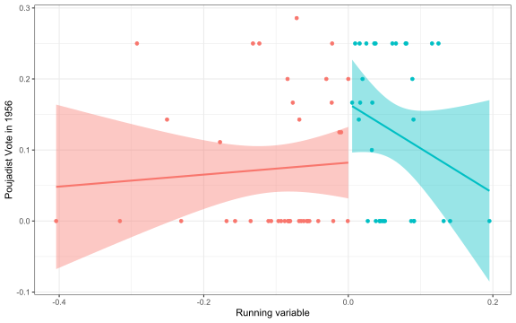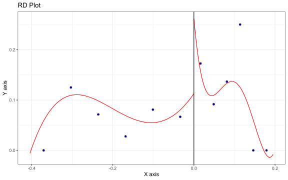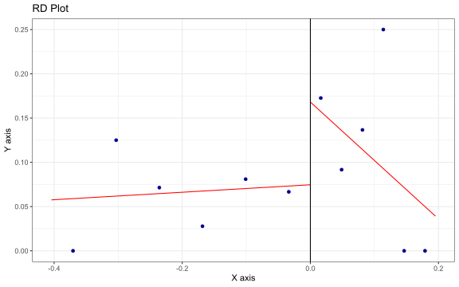

## RD Robust Estimation

The effect is significant and positive, between 17 and 19 percentage
points. This is substantial - the median seat share per department
(among those where a centrist *apparentement* took place in 1951) was 0,
and the standard deviation was 10 percentage points.

    ## Call: rdrobust
    ## 
    ## Sharp RD estimates using local polynomial regression.
    ## 
    ## Number of Obs.                   71
    ## BW type                       mserd
    ## Kernel                   Triangular
    ## VCE method                       NN
    ## 
    ##                                Left        Right
    ## Number of Obs.                   38           33
    ## Eff. Number of Obs.               7           14
    ## Order est. (p)                    1            1
    ## Order bias (q)                    2            2
    ## BW est. (h)                   0.039        0.039
    ## BW bias (b)                   0.060        0.060
    ## rho (h/b)                     0.647        0.647
    ## Unique Obs.                      38           33
    ## 
    ## =====================================================================
    ##                    Point    Robust Inference
    ##                 Estimate         z     P>|z|      [ 95% C.I. ]       
    ## ---------------------------------------------------------------------
    ##      RD Effect     0.190     2.771     0.006     [0.056 , 0.329]     
    ## =====================================================================

    ## Call: rdrobust
    ## 
    ## Sharp RD estimates using local polynomial regression.
    ## 
    ## Number of Obs.                   71
    ## BW type                       mserd
    ## Kernel                   Epanechnikov
    ## VCE method                       NN
    ## 
    ##                                Left        Right
    ## Number of Obs.                   38           33
    ## Eff. Number of Obs.               6            8
    ## Order est. (p)                    1            1
    ## Order bias (q)                    2            2
    ## BW est. (h)                   0.026        0.026
    ## BW bias (b)                   0.054        0.054
    ## rho (h/b)                     0.485        0.485
    ## Unique Obs.                      38           33
    ## 
    ## =====================================================================
    ##                    Point    Robust Inference
    ##                 Estimate         z     P>|z|      [ 95% C.I. ]       
    ## ---------------------------------------------------------------------
    ##      RD Effect     0.173     2.504     0.012     [0.041 , 0.336]     
    ## =====================================================================

    ## Call: rdrobust
    ## 
    ## Sharp RD estimates using local polynomial regression.
    ## 
    ## Number of Obs.                   71
    ## BW type                       mserd
    ## Kernel                      Uniform
    ## VCE method                       NN
    ## 
    ##                                Left        Right
    ## Number of Obs.                   38           33
    ## Eff. Number of Obs.               7           12
    ## Order est. (p)                    1            1
    ## Order bias (q)                    2            2
    ## BW est. (h)                   0.037        0.037
    ## BW bias (b)                   0.077        0.077
    ## rho (h/b)                     0.483        0.483
    ## Unique Obs.                      38           33
    ## 
    ## =====================================================================
    ##                    Point    Robust Inference
    ##                 Estimate         z     P>|z|      [ 95% C.I. ]       
    ## ---------------------------------------------------------------------
    ##      RD Effect     0.181     3.070     0.002     [0.074 , 0.338]     
    ## =====================================================================

The results are similar if we extend the sample to departments with RPF
*apparentements* in 1951, although smaller in magnitude.

    ## Call: rdrobust
    ## 
    ## Sharp RD estimates using local polynomial regression.
    ## 
    ## Number of Obs.                   83
    ## BW type                       mserd
    ## Kernel                   Triangular
    ## VCE method                       NN
    ## 
    ##                                Left        Right
    ## Number of Obs.                   43           40
    ## Eff. Number of Obs.               9           17
    ## Order est. (p)                    1            1
    ## Order bias (q)                    2            2
    ## BW est. (h)                   0.042        0.042
    ## BW bias (b)                   0.066        0.066
    ## rho (h/b)                     0.646        0.646
    ## Unique Obs.                      43           40
    ## 
    ## =====================================================================
    ##                    Point    Robust Inference
    ##                 Estimate         z     P>|z|      [ 95% C.I. ]       
    ## ---------------------------------------------------------------------
    ##      RD Effect     0.155     2.073     0.038     [0.009 , 0.307]     
    ## =====================================================================

    ## Call: rdrobust
    ## 
    ## Sharp RD estimates using local polynomial regression.
    ## 
    ## Number of Obs.                   83
    ## BW type                       mserd
    ## Kernel                   Epanechnikov
    ## VCE method                       NN
    ## 
    ##                                Left        Right
    ## Number of Obs.                   43           40
    ## Eff. Number of Obs.               8           17
    ## Order est. (p)                    1            1
    ## Order bias (q)                    2            2
    ## BW est. (h)                   0.040        0.040
    ## BW bias (b)                   0.066        0.066
    ## rho (h/b)                     0.610        0.610
    ## Unique Obs.                      43           40
    ## 
    ## =====================================================================
    ##                    Point    Robust Inference
    ##                 Estimate         z     P>|z|      [ 95% C.I. ]       
    ## ---------------------------------------------------------------------
    ##      RD Effect     0.151     1.986     0.047     [0.002 , 0.311]     
    ## =====================================================================

    ## Call: rdrobust
    ## 
    ## Sharp RD estimates using local polynomial regression.
    ## 
    ## Number of Obs.                   83
    ## BW type                       mserd
    ## Kernel                      Uniform
    ## VCE method                       NN
    ## 
    ##                                Left        Right
    ## Number of Obs.                   43           40
    ## Eff. Number of Obs.               8           15
    ## Order est. (p)                    1            1
    ## Order bias (q)                    2            2
    ## BW est. (h)                   0.037        0.037
    ## BW bias (b)                   0.076        0.076
    ## rho (h/b)                     0.494        0.494
    ## Unique Obs.                      43           40
    ## 
    ## =====================================================================
    ##                    Point    Robust Inference
    ##                 Estimate         z     P>|z|      [ 95% C.I. ]       
    ## ---------------------------------------------------------------------
    ##      RD Effect     0.128     1.894     0.058    [-0.005 , 0.309]     
    ## =====================================================================

## Local randomisation

With local randomisation, and using the same windows as above, the
difference in means is significant at the 5% level for the window with
the highest p-value, although not significant at conventional levels for
the smallest window.

    ## 
    ## Running rdwinselect...
    ## 
    ## rdwinselect complete.
    ## 
    ## Selected window = [-0.067;0.067] 
    ## 
    ## Running randomization-based test...
    ## Randomization-based test complete. 
    ## 
    ## 
    ## Number of obs     =            61
    ## Order of poly     =             0
    ## Kernel type       =       uniform
    ## Reps              =         10000
    ## Window            =   rdwinselect
    ## H0:          tau  =         0.000
    ## Randomization     = fixed margins
    ## 
    ## Cutoff c =    0.000   Left of c  Right of c
    ##       Number of obs          32          29
    ##  Eff. number of obs          11          17
    ##     Mean of outcome       0.045       0.130
    ##     S.d. of outcome       0.078       0.116
    ##              Window      -0.067       0.067
    ## 
    ## ================================================================================
    ##                                   Finite sample            Large sample         
    ##                                ------------------  -----------------------------
    ##           Statistic          T        P>|T|        P>|T|    Power vs d =   0.039
    ## ================================================================================
    ##      Diff. in means      0.085        0.044        0.020                   0.187
    ## ================================================================================

    ## 
    ## Selected window = [-0.057;0.057] 
    ## 
    ## Running randomization-based test...
    ## Randomization-based test complete. 
    ## 
    ## 
    ## Number of obs     =            61
    ## Order of poly     =             0
    ## Kernel type       =       uniform
    ## Reps              =         10000
    ## Window            =   set by user
    ## H0:          tau  =         0.000
    ## Randomization     = fixed margins
    ## 
    ## Cutoff c =    0.000   Left of c  Right of c
    ##       Number of obs          32          29
    ##  Eff. number of obs           9          15
    ##     Mean of outcome       0.055       0.114
    ##     S.d. of outcome       0.084       0.114
    ##              Window      -0.057       0.057
    ## 
    ## ================================================================================
    ##                                   Finite sample            Large sample         
    ##                                ------------------  -----------------------------
    ##           Statistic          T        P>|T|        P>|T|    Power vs d =   0.042
    ## ================================================================================
    ##      Diff. in means      0.059        0.188        0.145                   0.178
    ## ================================================================================

# DV is PCF vote

We now consider support for the PCF. As the main target of the *loi des
apparentements*, one might expect that it would be the most likely actor
to benefit from any popular backlash to it. However, the Communists were
also a large and pre-existing party, which had been in the provisional
governments following the war and which may not have mobilised
opposition to the electoral system to the same extent.

## Visual representation

Visually, the discontinuity is much less striking.

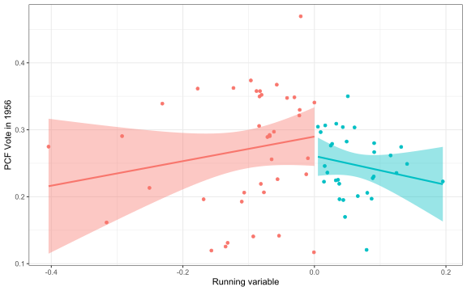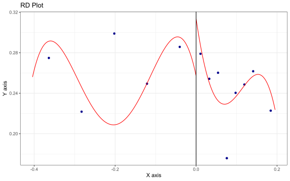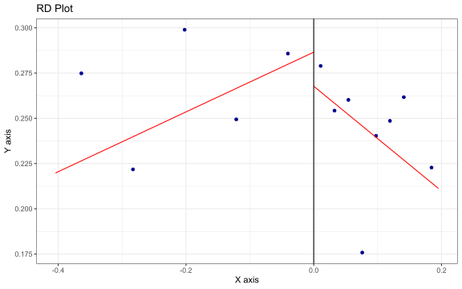

## RD Robust Estimation

we find no effect of an *apparentement* narrowly winning all the
department’s seats on subsequent support for the Communist party, when
examining only departments without RPF *apparentements*.

    ## Call: rdrobust
    ## 
    ## Sharp RD estimates using local polynomial regression.
    ## 
    ## Number of Obs.                   71
    ## BW type                       mserd
    ## Kernel                   Triangular
    ## VCE method                       NN
    ## 
    ##                                Left        Right
    ## Number of Obs.                   38           33
    ## Eff. Number of Obs.               8           19
    ## Order est. (p)                    1            1
    ## Order bias (q)                    2            2
    ## BW est. (h)                   0.051        0.051
    ## BW bias (b)                   0.091        0.091
    ## rho (h/b)                     0.559        0.559
    ## Unique Obs.                      38           33
    ## 
    ## =====================================================================
    ##                    Point    Robust Inference
    ##                 Estimate         z     P>|z|      [ 95% C.I. ]       
    ## ---------------------------------------------------------------------
    ##      RD Effect     0.161     1.418     0.156    [-0.069 , 0.432]     
    ## =====================================================================

    ## Call: rdrobust
    ## 
    ## Sharp RD estimates using local polynomial regression.
    ## 
    ## Number of Obs.                   71
    ## BW type                       mserd
    ## Kernel                   Epanechnikov
    ## VCE method                       NN
    ## 
    ##                                Left        Right
    ## Number of Obs.                   38           33
    ## Eff. Number of Obs.               8           18
    ## Order est. (p)                    1            1
    ## Order bias (q)                    2            2
    ## BW est. (h)                   0.049        0.049
    ## BW bias (b)                   0.090        0.090
    ## rho (h/b)                     0.543        0.543
    ## Unique Obs.                      38           33
    ## 
    ## =====================================================================
    ##                    Point    Robust Inference
    ##                 Estimate         z     P>|z|      [ 95% C.I. ]       
    ## ---------------------------------------------------------------------
    ##      RD Effect     0.148     1.404     0.160    [-0.066 , 0.399]     
    ## =====================================================================

    ## Call: rdrobust
    ## 
    ## Sharp RD estimates using local polynomial regression.
    ## 
    ## Number of Obs.                   71
    ## BW type                       mserd
    ## Kernel                      Uniform
    ## VCE method                       NN
    ## 
    ##                                Left        Right
    ## Number of Obs.                   38           33
    ## Eff. Number of Obs.              11           19
    ## Order est. (p)                    1            1
    ## Order bias (q)                    2            2
    ## BW est. (h)                   0.059        0.059
    ## BW bias (b)                   0.113        0.113
    ## rho (h/b)                     0.525        0.525
    ## Unique Obs.                      38           33
    ## 
    ## =====================================================================
    ##                    Point    Robust Inference
    ##                 Estimate         z     P>|z|      [ 95% C.I. ]       
    ## ---------------------------------------------------------------------
    ##      RD Effect     0.021     0.555     0.579    [-0.120 , 0.215]     
    ## =====================================================================

As before, the effect remains insignificant at conventional levels when
including RPF *apparentements*.

    ## Call: rdrobust
    ## 
    ## Sharp RD estimates using local polynomial regression.
    ## 
    ## Number of Obs.                   81
    ## BW type                       mserd
    ## Kernel                   Triangular
    ## VCE method                       NN
    ## 
    ##                                Left        Right
    ## Number of Obs.                   43           38
    ## Eff. Number of Obs.              13           21
    ## Order est. (p)                    1            1
    ## Order bias (q)                    2            2
    ## BW est. (h)                   0.057        0.057
    ## BW bias (b)                   0.098        0.098
    ## rho (h/b)                     0.585        0.585
    ## Unique Obs.                      43           38
    ## 
    ## =====================================================================
    ##                    Point    Robust Inference
    ##                 Estimate         z     P>|z|      [ 95% C.I. ]       
    ## ---------------------------------------------------------------------
    ##      RD Effect     0.087     0.901     0.368    [-0.123 , 0.333]     
    ## =====================================================================

    ## Call: rdrobust
    ## 
    ## Sharp RD estimates using local polynomial regression.
    ## 
    ## Number of Obs.                   81
    ## BW type                       mserd
    ## Kernel                   Epanechnikov
    ## VCE method                       NN
    ## 
    ##                                Left        Right
    ## Number of Obs.                   43           38
    ## Eff. Number of Obs.              15           22
    ## Order est. (p)                    1            1
    ## Order bias (q)                    2            2
    ## BW est. (h)                   0.063        0.063
    ## BW bias (b)                   0.110        0.110
    ## rho (h/b)                     0.575        0.575
    ## Unique Obs.                      43           38
    ## 
    ## =====================================================================
    ##                    Point    Robust Inference
    ##                 Estimate         z     P>|z|      [ 95% C.I. ]       
    ## ---------------------------------------------------------------------
    ##      RD Effect     0.017     0.302     0.763    [-0.156 , 0.213]     
    ## =====================================================================

    ## Call: rdrobust
    ## 
    ## Sharp RD estimates using local polynomial regression.
    ## 
    ## Number of Obs.                   81
    ## BW type                       mserd
    ## Kernel                      Uniform
    ## VCE method                       NN
    ## 
    ##                                Left        Right
    ## Number of Obs.                   43           38
    ## Eff. Number of Obs.               9           20
    ## Order est. (p)                    1            1
    ## Order bias (q)                    2            2
    ## BW est. (h)                   0.051        0.051
    ## BW bias (b)                   0.086        0.086
    ## rho (h/b)                     0.590        0.590
    ## Unique Obs.                      43           38
    ## 
    ## =====================================================================
    ##                    Point    Robust Inference
    ##                 Estimate         z     P>|z|      [ 95% C.I. ]       
    ## ---------------------------------------------------------------------
    ##      RD Effect     0.082     0.798     0.425    [-0.123 , 0.293]     
    ## =====================================================================

Finally, local randomisation also yields no significant difference in
means at the same windows as above.

    ## 
    ## Running rdwinselect...
    ## 
    ## rdwinselect complete.
    ## 
    ## Selected window = [-0.067;0.067] 
    ## 
    ## Running randomization-based test...
    ## Randomization-based test complete. 
    ## 
    ## 
    ## Number of obs     =            61
    ## Order of poly     =             0
    ## Kernel type       =       uniform
    ## Reps              =         10000
    ## Window            =   rdwinselect
    ## H0:          tau  =         0.000
    ## Randomization     = fixed margins
    ## 
    ## Cutoff c =    0.000   Left of c  Right of c
    ##       Number of obs          32          29
    ##  Eff. number of obs          11          17
    ##     Mean of outcome       0.284       0.261
    ##     S.d. of outcome       0.103       0.054
    ##              Window      -0.067       0.067
    ## 
    ## ================================================================================
    ##                                   Finite sample            Large sample         
    ##                                ------------------  -----------------------------
    ##           Statistic          T        P>|T|        P>|T|    Power vs d =   0.051
    ## ================================================================================
    ##      Diff. in means     -0.024        0.435        0.485                   0.333
    ## ================================================================================

    ## 
    ## Selected window = [-0.057;0.057] 
    ## 
    ## Running randomization-based test...
    ## Randomization-based test complete. 
    ## 
    ## 
    ## Number of obs     =            61
    ## Order of poly     =             0
    ## Kernel type       =       uniform
    ## Reps              =         10000
    ## Window            =   set by user
    ## H0:          tau  =         0.000
    ## Randomization     = fixed margins
    ## 
    ## Cutoff c =    0.000   Left of c  Right of c
    ##       Number of obs          32          29
    ##  Eff. number of obs           9          15
    ##     Mean of outcome       0.286       0.262
    ##     S.d. of outcome       0.115       0.054
    ##              Window      -0.057       0.057
    ## 
    ## ================================================================================
    ##                                   Finite sample            Large sample         
    ##                                ------------------  -----------------------------
    ##           Statistic          T        P>|T|        P>|T|    Power vs d =   0.057
    ## ================================================================================
    ##      Diff. in means     -0.024        0.496        0.553                   0.291
    ## ================================================================================

# DV is 1956 Turnout

We now turn to turnout in 1956.

## Visual representation

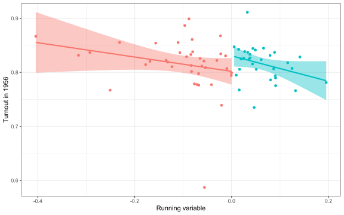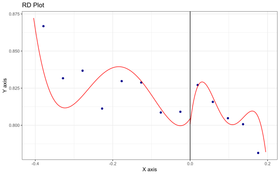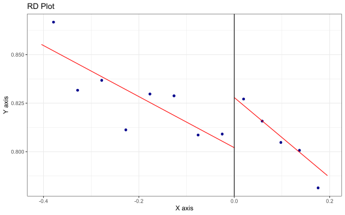

## RD Robust Estimation

As one might have expected given the plots above, there is no
significant discontinuity at the cutoff when examining 1956 turnout
among departments with a centrist *apparentement* in 1951.

    ## Call: rdrobust
    ## 
    ## Sharp RD estimates using local polynomial regression.
    ## 
    ## Number of Obs.                   71
    ## BW type                       mserd
    ## Kernel                   Triangular
    ## VCE method                       NN
    ## 
    ##                                Left        Right
    ## Number of Obs.                   38           33
    ## Eff. Number of Obs.               9           19
    ## Order est. (p)                    1            1
    ## Order bias (q)                    2            2
    ## BW est. (h)                   0.054        0.054
    ## BW bias (b)                   0.110        0.110
    ## rho (h/b)                     0.491        0.491
    ## Unique Obs.                      38           33
    ## 
    ## =====================================================================
    ##                    Point    Robust Inference
    ##                 Estimate         z     P>|z|      [ 95% C.I. ]       
    ## ---------------------------------------------------------------------
    ##      RD Effect     0.005    -0.161     0.872    [-0.044 , 0.037]     
    ## =====================================================================

    ## Call: rdrobust
    ## 
    ## Sharp RD estimates using local polynomial regression.
    ## 
    ## Number of Obs.                   71
    ## BW type                       mserd
    ## Kernel                   Epanechnikov
    ## VCE method                       NN
    ## 
    ##                                Left        Right
    ## Number of Obs.                   38           33
    ## Eff. Number of Obs.               8           18
    ## Order est. (p)                    1            1
    ## Order bias (q)                    2            2
    ## BW est. (h)                   0.050        0.050
    ## BW bias (b)                   0.114        0.114
    ## rho (h/b)                     0.434        0.434
    ## Unique Obs.                      38           33
    ## 
    ## =====================================================================
    ##                    Point    Robust Inference
    ##                 Estimate         z     P>|z|      [ 95% C.I. ]       
    ## ---------------------------------------------------------------------
    ##      RD Effect     0.002    -0.355     0.722    [-0.051 , 0.035]     
    ## =====================================================================

    ## Call: rdrobust
    ## 
    ## Sharp RD estimates using local polynomial regression.
    ## 
    ## Number of Obs.                   71
    ## BW type                       mserd
    ## Kernel                      Uniform
    ## VCE method                       NN
    ## 
    ##                                Left        Right
    ## Number of Obs.                   38           33
    ## Eff. Number of Obs.               8           14
    ## Order est. (p)                    1            1
    ## Order bias (q)                    2            2
    ## BW est. (h)                   0.042        0.042
    ## BW bias (b)                   0.078        0.078
    ## rho (h/b)                     0.537        0.537
    ## Unique Obs.                      38           33
    ## 
    ## =====================================================================
    ##                    Point    Robust Inference
    ##                 Estimate         z     P>|z|      [ 95% C.I. ]       
    ## ---------------------------------------------------------------------
    ##      RD Effect    -0.010    -0.574     0.566    [-0.067 , 0.037]     
    ## =====================================================================

The effect remains insignificant when considering the extended sample of
all *apparentement* departments.

    ## Call: rdrobust
    ## 
    ## Sharp RD estimates using local polynomial regression.
    ## 
    ## Number of Obs.                   83
    ## BW type                       mserd
    ## Kernel                   Triangular
    ## VCE method                       NN
    ## 
    ##                                Left        Right
    ## Number of Obs.                   43           40
    ## Eff. Number of Obs.              14           23
    ## Order est. (p)                    1            1
    ## Order bias (q)                    2            2
    ## BW est. (h)                   0.058        0.058
    ## BW bias (b)                   0.124        0.124
    ## rho (h/b)                     0.467        0.467
    ## Unique Obs.                      43           40
    ## 
    ## =====================================================================
    ##                    Point    Robust Inference
    ##                 Estimate         z     P>|z|      [ 95% C.I. ]       
    ## ---------------------------------------------------------------------
    ##      RD Effect     0.003    -0.252     0.801    [-0.046 , 0.035]     
    ## =====================================================================

    ## Call: rdrobust
    ## 
    ## Sharp RD estimates using local polynomial regression.
    ## 
    ## Number of Obs.                   83
    ## BW type                       mserd
    ## Kernel                   Epanechnikov
    ## VCE method                       NN
    ## 
    ##                                Left        Right
    ## Number of Obs.                   43           40
    ## Eff. Number of Obs.               9           23
    ## Order est. (p)                    1            1
    ## Order bias (q)                    2            2
    ## BW est. (h)                   0.051        0.051
    ## BW bias (b)                   0.105        0.105
    ## rho (h/b)                     0.485        0.485
    ## Unique Obs.                      43           40
    ## 
    ## =====================================================================
    ##                    Point    Robust Inference
    ##                 Estimate         z     P>|z|      [ 95% C.I. ]       
    ## ---------------------------------------------------------------------
    ##      RD Effect     0.008     0.003     0.998    [-0.041 , 0.041]     
    ## =====================================================================

    ## Call: rdrobust
    ## 
    ## Sharp RD estimates using local polynomial regression.
    ## 
    ## Number of Obs.                   83
    ## BW type                       mserd
    ## Kernel                      Uniform
    ## VCE method                       NN
    ## 
    ##                                Left        Right
    ## Number of Obs.                   43           40
    ## Eff. Number of Obs.               9           17
    ## Order est. (p)                    1            1
    ## Order bias (q)                    2            2
    ## BW est. (h)                   0.043        0.043
    ## BW bias (b)                   0.079        0.079
    ## rho (h/b)                     0.540        0.540
    ## Unique Obs.                      43           40
    ## 
    ## =====================================================================
    ##                    Point    Robust Inference
    ##                 Estimate         z     P>|z|      [ 95% C.I. ]       
    ## ---------------------------------------------------------------------
    ##      RD Effect    -0.005    -0.137     0.891    [-0.054 , 0.047]     
    ## =====================================================================

The difference in means yielded by the local randomisation procedure is
also insignificant.

    ## 
    ## Running rdwinselect...
    ## 
    ## rdwinselect complete.
    ## 
    ## Selected window = [-0.067;0.067] 
    ## 
    ## Running randomization-based test...
    ## Randomization-based test complete. 
    ## 
    ## 
    ## Number of obs     =            61
    ## Order of poly     =             0
    ## Kernel type       =       uniform
    ## Reps              =         10000
    ## Window            =   rdwinselect
    ## H0:          tau  =         0.000
    ## Randomization     = fixed margins
    ## 
    ## Cutoff c =    0.000   Left of c  Right of c
    ##       Number of obs          32          29
    ##  Eff. number of obs          11          17
    ##     Mean of outcome       0.790       0.815
    ##     S.d. of outcome       0.075       0.029
    ##              Window      -0.067       0.067
    ## 
    ## ================================================================================
    ##                                   Finite sample            Large sample         
    ##                                ------------------  -----------------------------
    ##           Statistic          T        P>|T|        P>|T|    Power vs d =   0.037
    ## ================================================================================
    ##      Diff. in means      0.026        0.214        0.275                   0.353
    ## ================================================================================

    ## 
    ## Selected window = [-0.057;0.057] 
    ## 
    ## Running randomization-based test...
    ## Randomization-based test complete. 
    ## 
    ## 
    ## Number of obs     =            61
    ## Order of poly     =             0
    ## Kernel type       =       uniform
    ## Reps              =         10000
    ## Window            =   set by user
    ## H0:          tau  =         0.000
    ## Randomization     = fixed margins
    ## 
    ## Cutoff c =    0.000   Left of c  Right of c
    ##       Number of obs          32          29
    ##  Eff. number of obs           9          15
    ##     Mean of outcome       0.783       0.813
    ##     S.d. of outcome       0.082       0.030
    ##              Window      -0.057       0.057
    ## 
    ## ================================================================================
    ##                                   Finite sample            Large sample         
    ##                                ------------------  -----------------------------
    ##           Statistic          T        P>|T|        P>|T|    Power vs d =   0.041
    ## ================================================================================
    ##      Diff. in means      0.030        0.224        0.294                   0.303
    ## ================================================================================

# Covariates

We can also assess whether this discontinuity appears in covariates
which should not be affected by it. These are the same ones we used
earlier to identify the window around which local randomisation could be
expected to hold: the share of non-French peope, the share of farmers,
the share of industrial workers, the unemployment rate, the department’s
budget revenue, and the share of people without primary education.

Visually, we find no discontinuity as striking as that in Poujadist
support.

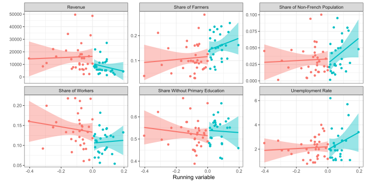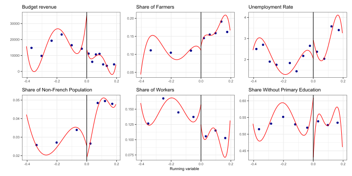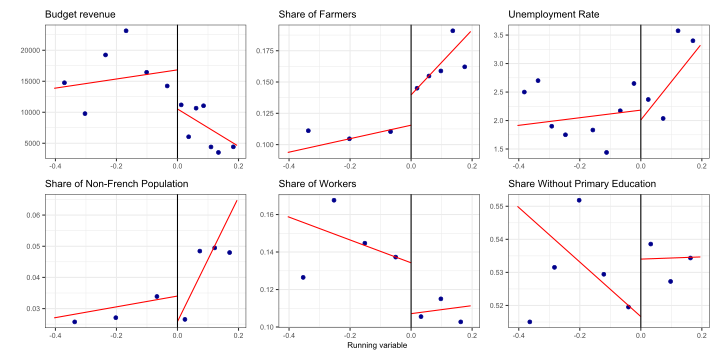

If we now estimate similar RD models for each variable and kernel and at
the MSE optimal bandwidth, we can plot their estimates and confidence
intervals. We see that, across the vast majority of specifications,
there is no discontinuity at the cutoff.

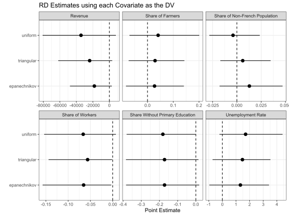
